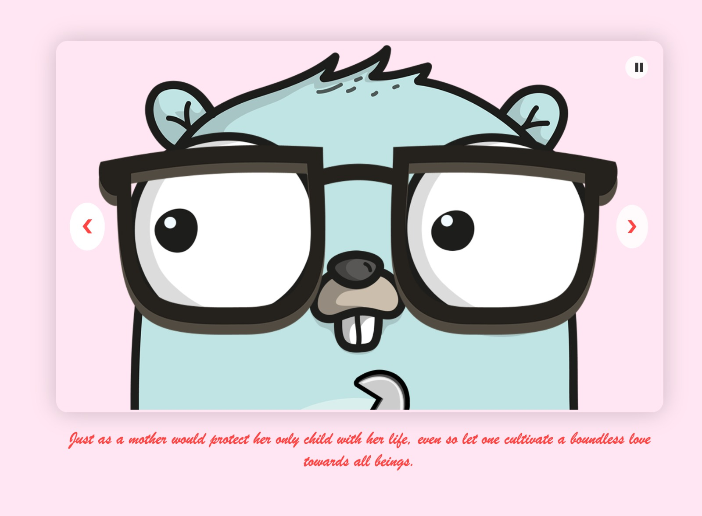
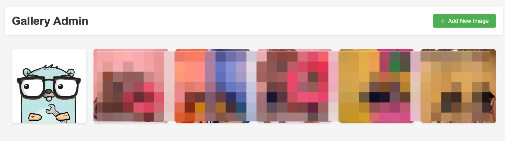

# Slideshow Love Story

sweet and romantic valentine website displaying a beautiful slide-show photo gallery with warm playable audio.

## Preview

### Envelope


### Slideshow


### Manage Photo


## Prerequisites
- You're a pimp to your partner 
- You're bored || you're being caught cheating
- You're a programmer
- Node.js (v16 or higher)
- npm or yarn

## Installation

1. Clone the repository:
```bash
git clone [repository-url]
cd gallery-love-story
```

2. Install dependencies:
```bash
npm install
```

3. Create a `.env` file in the root directory with the following variables:
```env
APP_ENV=development
PORT=3000
APP_USER=
APP_PASSWORD=
```
or just cp the `.env.❤️` file

4. Set up repository:
   - Once you setup, deployed it.
   - It's should create github pages for you for static content

5. Configure Heroku:
   - Create a Hekoru account
   - Add new apps
   - Setup config vars to repository
   - Or you can also manual deploy from remote repository through heroku dashboard 